# Render Pipeline

#### URP Shadow Caster Pass

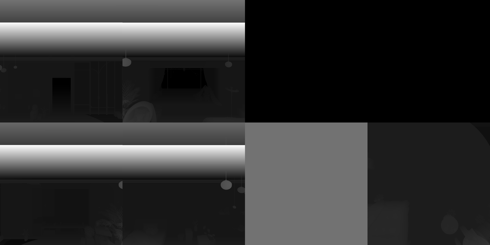

#### Per Object Shadow Caster Pass

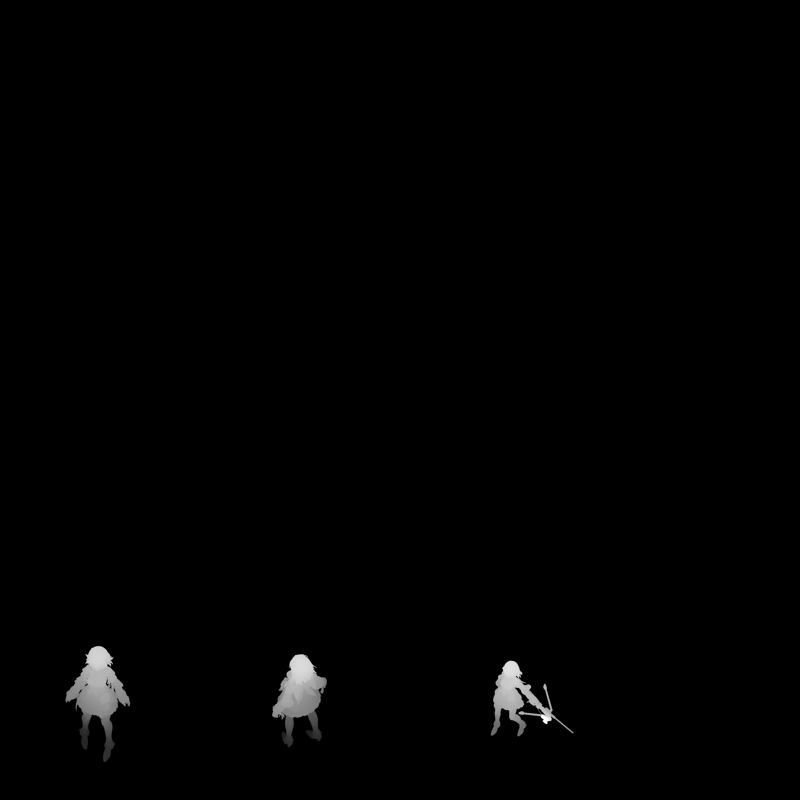

#### GBuffer Pass

###### GBuffer0.rgb

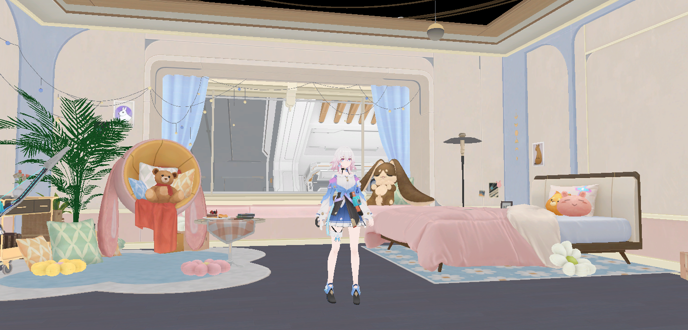

###### GBuffer0.a

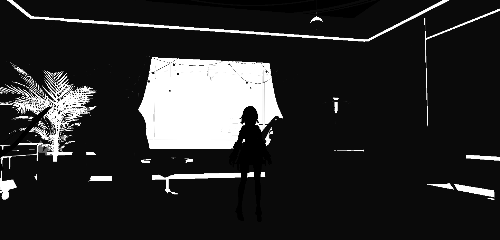

###### GBuffer1.rgb

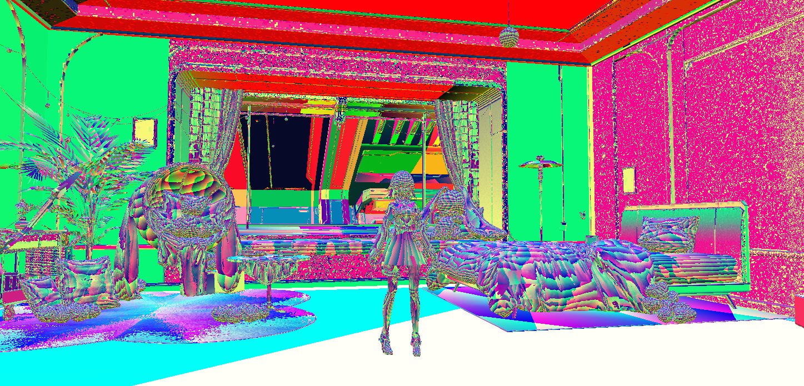

###### GBuffer1.a

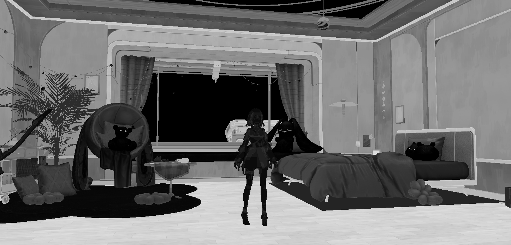

###### GBuffer2.rgb

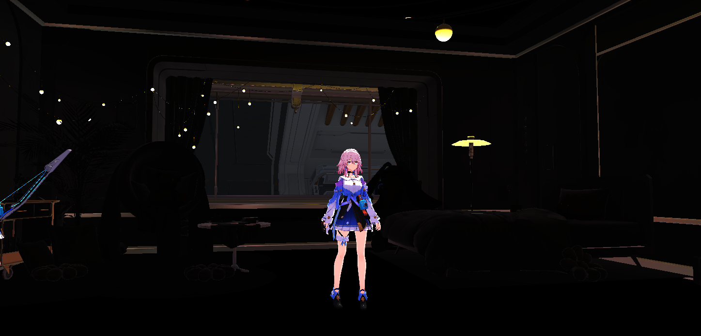

###### Depth [0.0, 0.1]

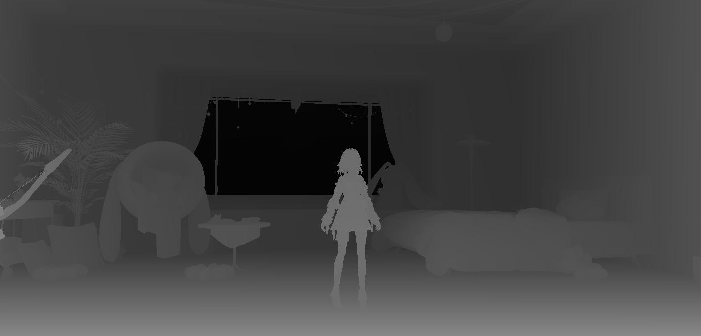

###### Stencil

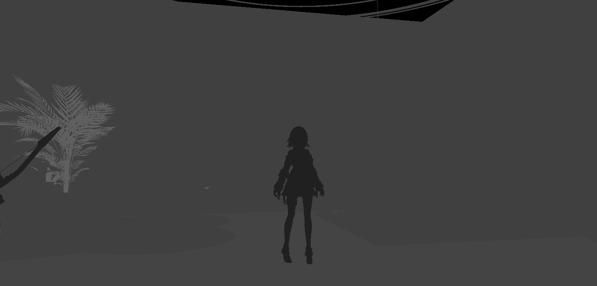

#### Copy Depth and Pyramid

> [!NOTE]
>
> Range: [0.0, 0.1]

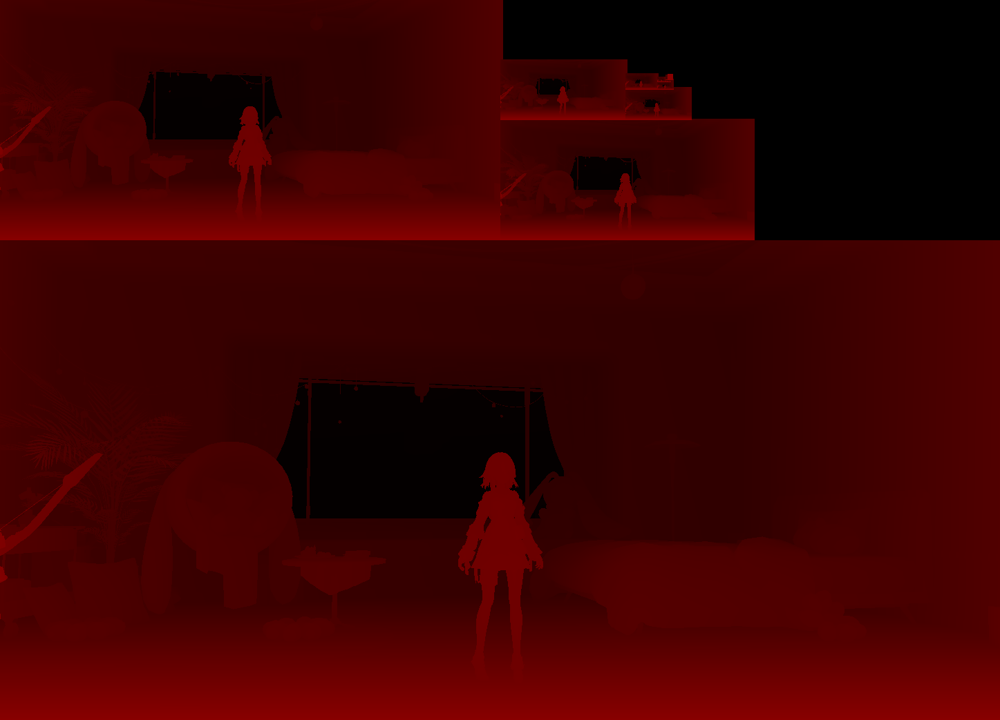

#### Screen Space Shadow

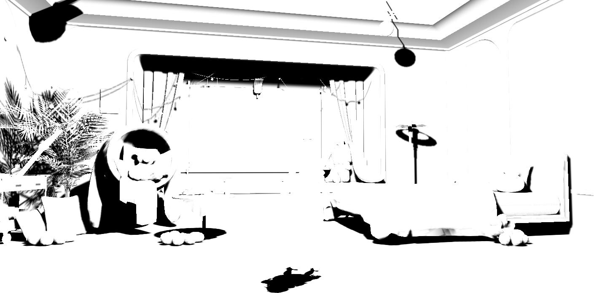

#### Deferred Stencil Lighting

#### URP Render Skybox

Use URP Pass.

#### CRP Transparent

Use Forward Lighting.

#### CRP Motion Vector

> [!NOTE]
>
> Range: [0.0, 0.00015]

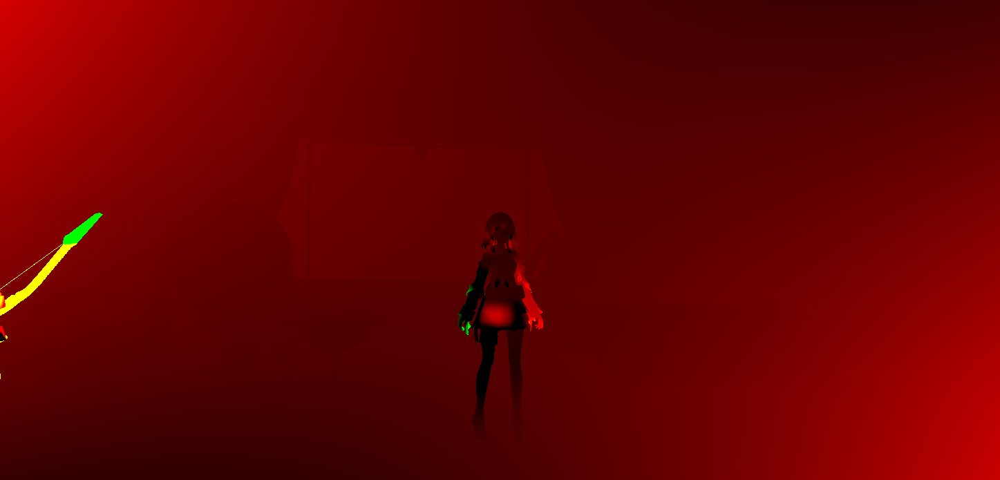

#### CRP SSR

###### UV Mapping Texture

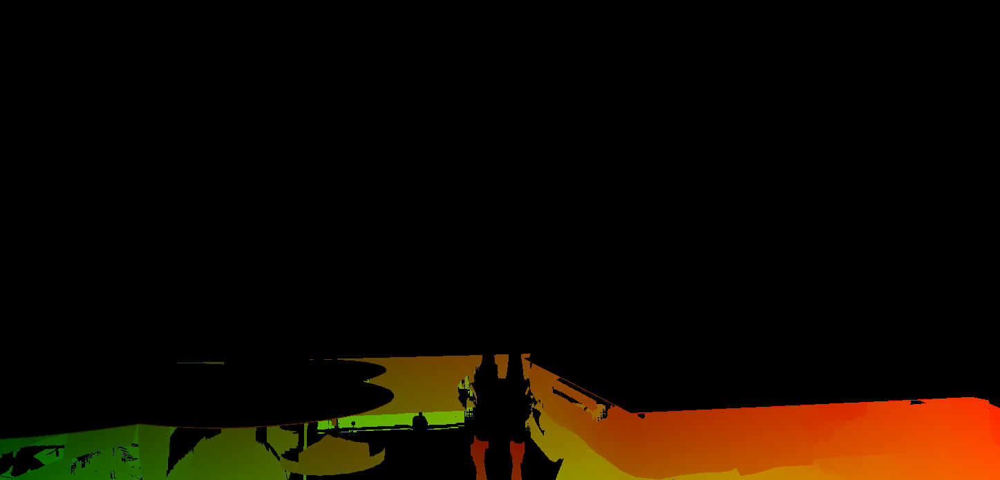

###### Draw SSR

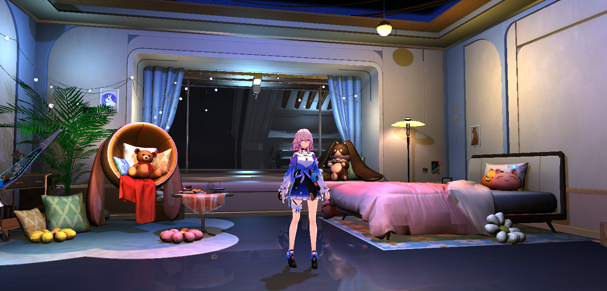

#### Copy Color and Pyramid

Result Mip 2:

#### CRP TAA

#### CRP Post Process

###### Bloom

Bloom Texture:

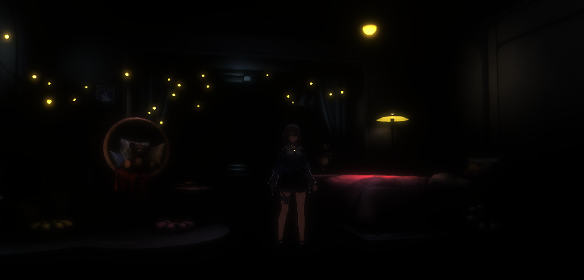

###### Tone Mapping

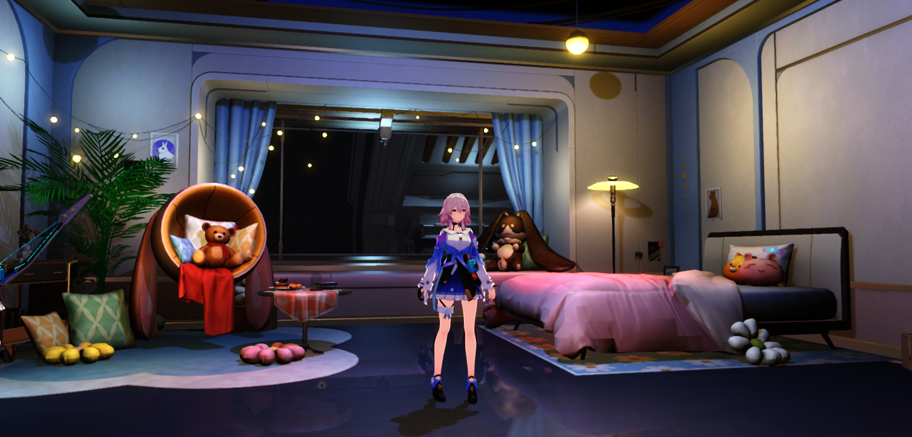

#### URP Post Process

Use URP post process.