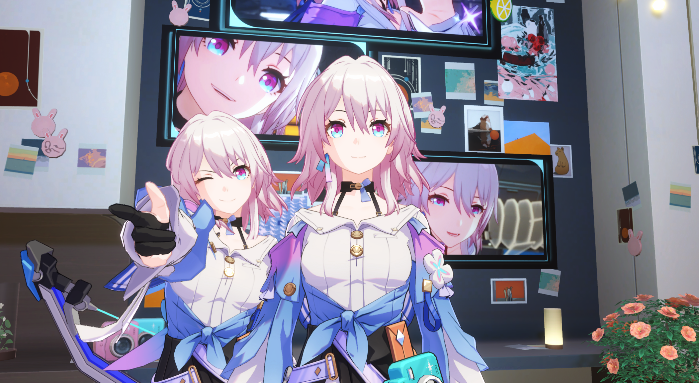
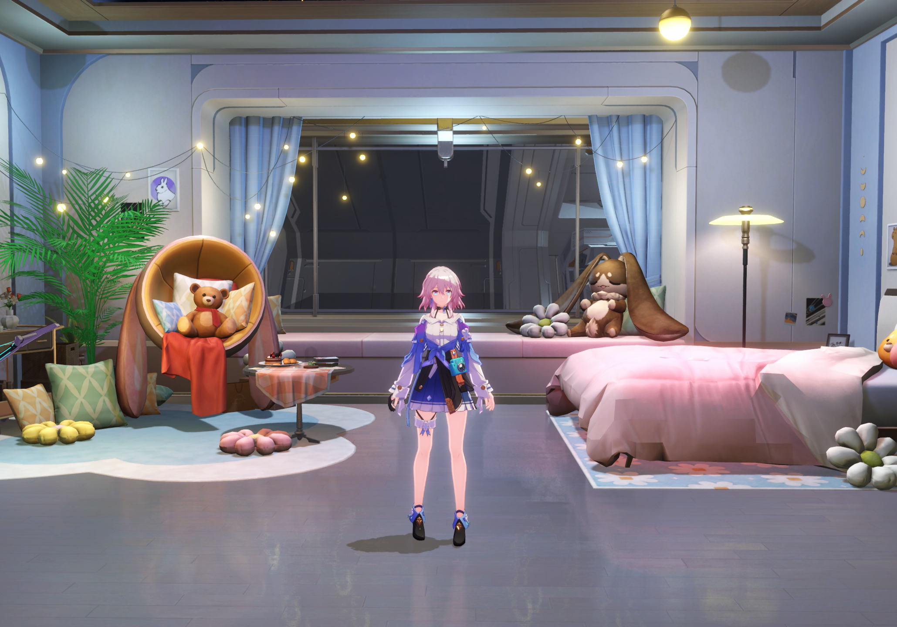
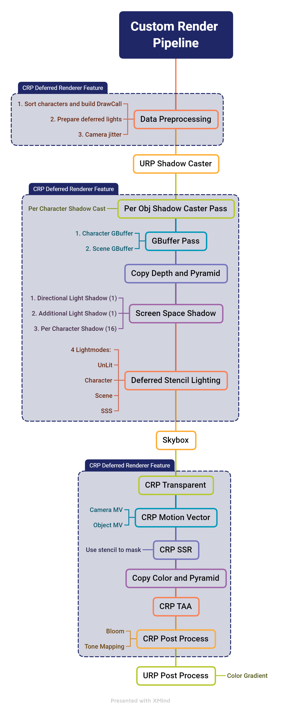

# Unity_StarRail_CRP_Sample

An example of a custom rendering pipeline that restores the rendering of HSR

### Effect

> [!NOTE] 
>
> Initial results. Will continue to adjust and optimize later.

###### Video:

https://github.com/ChillyHub/Unity_StarRail_CRP_Sample/assets/75598757/70a140ba-5c9e-45eb-a1bd-00d58aa083cb

https://github.com/ChillyHub/Unity_StarRail_CRP_Sample/assets/75598757/d4a82116-1efc-464e-8d14-abc0946d0067

### Demo

Here is a very simple demo for Windows x64:

[Demo Release v0.0.1](https://github.com/ChillyHub/Unity_StarRail_CRP_Sample/releases/tag/v0.0.1)

> [!Tip]
>
> The operation is similar to the game.

### Project Requirements

- Unity 2022.3.8f1 (Base on URP)
- Git and Git LFS

> [!IMPORTANT]
>
> Before clone this project, make sure you have install Git LFS. Otherwise some big FBX files will not clone successfully.
>
> Download Git from [this website](https://git-scm.com/downloads), and install. 
>
> Then run   `` git lfs install``
> 
> Use ``git lfs clone https://github.com/ChillyHub/Unity_StarRail_CRP_Sample.git`` to clone

> [!WARNING]
>
> Currently, there may be memory leak problem in multiple cameras and preview cameras, which needs to be fixed.

### About Custom Render Pipeline

Use a single Renderer Feature to manage custom passes. Use stencil deferred rendering for more colorful lighting. Also, per object shadows are used on the characters to achieve more variable shadow effects. This pipeline also has SSR and TAA Pass to help express more delicate images.

The following is the flow chart of the rendering pipeline:

> [!TIP]
>
> For more information, read [RenderPipeline.md](./Documents~/RenderPipeline.md) and get details.

### Future

- To support decal rendering
- To support decal screen space shadow
- Add HBAO
- Add Volume Light
- Add Screen Space Fog
- More Efficient Bloom (Less RT switch)
