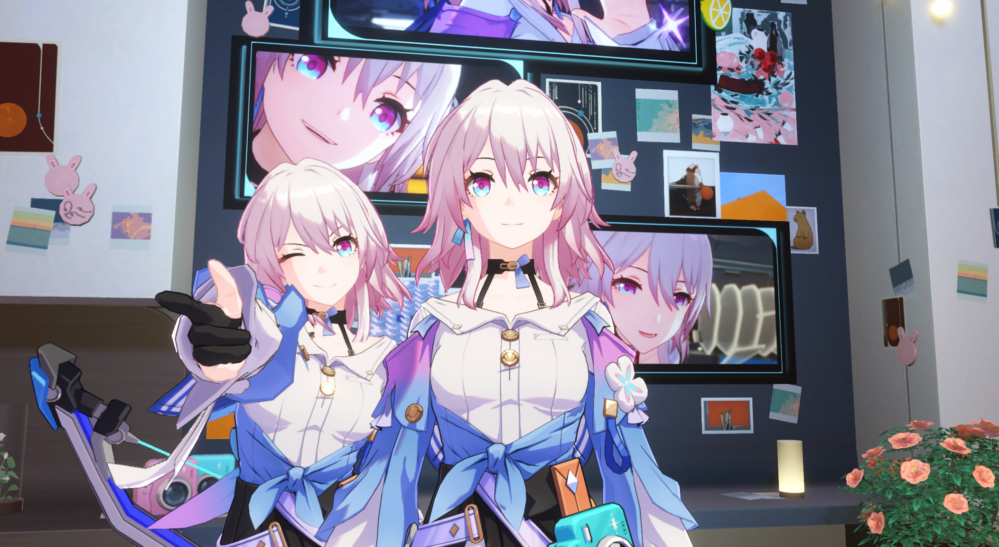

# Unity_StarRail_CRP_Sample

一个基于URP Renderer Feature 的模仿还原崩坏星穹铁道渲染的自定义渲染管道示例

>  [!Tip]
>
> [English README Is Here](./README.md)

### 效果

> [!NOTE] 
>
> 初步的效果实例。后面会继续调整并优化相关渲染效果。

##### [场景] 三月七房间：

https://github.com/ChillyHub/Unity_StarRail_CRP_Sample/assets/75598757/2e4ecfe2-7448-4b26-bdde-54d03e07c71a

https://github.com/ChillyHub/Unity_StarRail_CRP_Sample/assets/75598757/0be8118c-f2dc-488b-bf2d-ce515bf3dd05

**支持角色阴影的贴画光照 --**

https://github.com/ChillyHub/Unity_StarRail_CRP_Sample/assets/75598757/783b5b65-ee59-44ac-9ce2-dc78c2274130

##### [场景] 星穹列车：

> 未完工

##### [场景] 角色展示：

> 角色不接受自阴影的同时，能够接受来自场景环境的阴影。

https://github.com/ChillyHub/Unity_StarRail_CRP_Sample/assets/75598757/c6adbb45-d92e-4af0-ae3c-3de62aabdd3c

### 实例程序 Demo

下面是一个非常简单的程序实例，基于 Windows 64 平台：[Demo Release v0.0.2](https://github.com/ChillyHub/Unity_StarRail_CRP_Sample/releases/tag/v0.0.2)

Android 版 Demo 鸽了。

> [!Tip]
>
> 输入操作类似星穹铁道游戏，详细可看 Release 中的解释。

### 项目依赖

- Unity 2022.3.8f1 (基于 URP 渲染管线)
- Git 和 Git LFS

> [!IMPORTANT]
>
> 克隆项目之前，确保已经安装 Git LFS。否则一些较大的FBX文件无法正确克隆。
>
> 在[这个网址](https://git-scm.com/downloads)下载并安装 Git 。
>
> 然后运行    `` git lfs install``。
>
> 再运行  ``git lfs clone https://github.com/ChillyHub/Unity_StarRail_CRP_Sample.git`` 克隆。
>
> 如果仍然无法完整下载，可以从[Demo Release v0.0.2](https://github.com/ChillyHub/Unity_StarRail_CRP_Sample/releases/tag/v0.0.2)下载 unitypackage 包。

> [!WARNING]
>
> 目前，在编辑器模式下有多相机或预览相机窗口时可能会出现内存泄漏，后面需要修复。请注意内存占用。

### 关于自定义的渲染管线

使用单个 Custom Renderer Feature 来管理所有的自定义 Pass。 使用基于模板的延迟渲染，以更高效的实现更丰富多彩的照明。 此外，每个角色单独进行阴影投射（ShadowCaster），以实现更多可变，自定义的阴影效果。 该管道还有屏幕空间反射（SSR）和 时域抗锯齿（TAA） 来帮助表达更细腻的图像。

以下是渲染管线的流程图：

> [!TIP]
>
> 了解更多关于渲染管线的信息，可以阅读 [RenderPipeline.md](./Documents~/RenderPipeline.md) 以获取细节。

### 资产来源

- miHoYo: 角色模型，贴图，动作数据。
- Viero月城：三月七房间等场景模型贴图。

### 未来计划

- 添加 HBAO 屏幕空间阴影
- 添加体积光
- 添加屏幕空间雾效
- 更高效的光晕（Bloom）算法。 （更少的RT切换）
